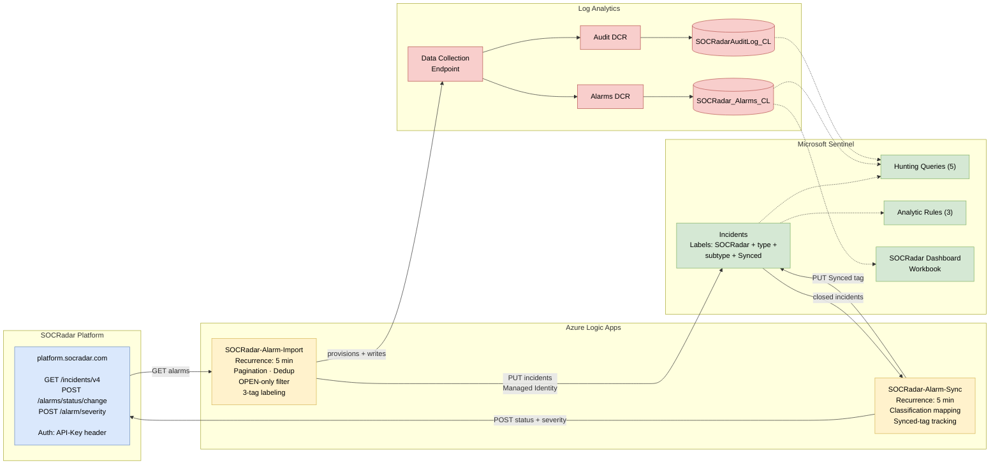

# SOCRadar Intelligence for Microsoft Sentinel

## Overview

The SOCRadar solution for Microsoft Sentinel provides bidirectional integration between SOCRadar XTI Platform and Microsoft Sentinel. Import SOCRadar alarms as Microsoft Sentinel incidents and sync closed incidents back to SOCRadar with classification mapping.

## Architecture

## Key Features

**Alarm Import**
- Automatically imports SOCRadar alarms as Microsoft Sentinel incidents
- Paginated fetching with duplicate prevention
- Severity and status mapping
- Tags for categorization (SOCRadar, alarm type, sub type)
- Optional closed alarm import with classification
- Incident mode: `Direct` creates incidents through the Microsoft Sentinel API; `AlertBacked` writes each alarm to `SOCRadar_Alarms_CL` and deploys a scheduled analytics rule that raises the incident, so it also appears in the Microsoft Defender portal's incident queue. In that mode the **SOCRadar High or Critical Severity Alarm** analytics rule template is redundant (every open alarm already raises an incident); leave it disabled. Verified against a workspace that is not connected to Microsoft Defender XDR; on a connected workspace Sync still resolves the alarm from the incident's URL entity, but the severity line in the description may be absent. Each alarm is written once and the incident is Microsoft Sentinel's to create; if the platform skips a rule run, those alarms are not re-alerted (`Direct` has no such dependency)

**Bidirectional Sync**
- Closed incidents in Microsoft Sentinel update alarm status in SOCRadar
- Classification mapping: TruePositive to Resolved, FalsePositive to False Positive, BenignPositive to Mitigated

**Analytics**
- SOCRadar Dashboard workbook with severity, status, and timeline charts
- 5 hunting queries for alarm analysis and correlation
- Optional audit logging for operational monitoring

## Prerequisites

- Microsoft Sentinel workspace
- SOCRadar XTI Platform API Key ([socradar.io](https://socradar.io))
- SOCRadar Company ID

## Installation

Install the SOCRadar solution from the Microsoft Sentinel **Content Hub**, then create each playbook from its template.

1. In Microsoft Sentinel, go to **Content Hub**
2. Search for **SOCRadar** and click **Install**
3. Go to **Configuration** &gt; **Automation** &gt; **Playbook templates**
4. Create the **SOCRadar-Alarm-Import** playbook. Deploying this playbook provisions all of its Log Analytics infrastructure — Data Collection Endpoint, custom tables (`SOCRadar_Alarms_CL`, `SOCRadarAuditLog_CL`), Data Collection Rules, and the required role assignments for the Logic App Managed Identity — along with the alarm import Logic App itself.
5. (Optional) Create the **SOCRadar-Alarm-Sync** playbook for bidirectional sync back to SOCRadar.

Logic Apps start 3 minutes after deployment to allow Azure role propagation.

## Playbooks

| Playbook | Description |
|----------|-------------|
| [SOCRadar-Alarm-Import](Playbooks/SOCRadar-Alarm-Import) | Imports SOCRadar alarms as Microsoft Sentinel incidents, directly or through a scheduled analytics rule (`IncidentMode`). Provisions the DCE, custom log tables, and DCRs required by this solution. |
| [SOCRadar-Alarm-Sync](Playbooks/SOCRadar-Alarm-Sync) | Syncs closed Microsoft Sentinel incidents back to SOCRadar with classification mapping. |

Both playbooks use Managed Identity for authentication.

## About SOCRadar

SOCRadar is an Extended Threat Intelligence (XTI) platform that provides actionable threat intelligence, digital risk protection, and external attack surface management.

Learn more at [socradar.io](https://socradar.io)

## Support

- **Public Documentation:** [Microsoft Sentinel Integration — One-Click Deployment Guide](https://github.com/Radargoger/azure-one-click-documentations/blob/main/azureincidents.md)
- **Detailed Documentation (SOCRadar customers):** [Microsoft Azure Sentinel Integration (Bi-Directional)](https://help.socradar.io/hc/en-us/articles/41316851769745-Microsoft-Azure-Sentinel-Integration-Bi-Directional)
- **Support:** integration@socradar.io
